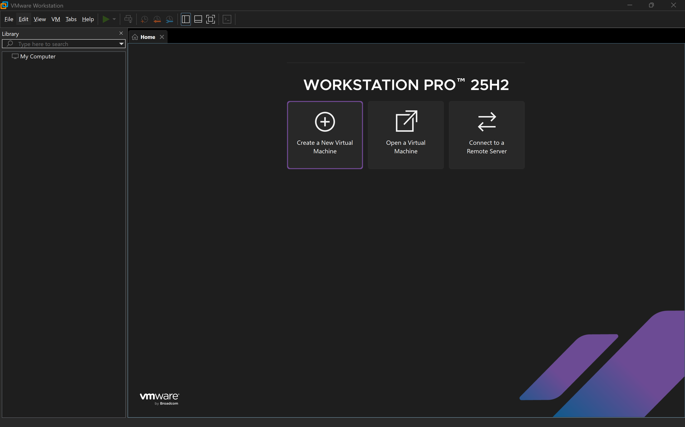

# Cybersecurity Virtual Lab (SOC Training Environment)

## Overview

This project is a virtual cybersecurity lab built using VMware Workstation Pro. It simulates a small Security Operations Center (SOC) environment where an attacker machine (Kali Linux) interacts with vulnerable and target systems (Windows 10 and Metasploitable 2).

The goal of this project is to demonstrate practical skills in:

- Virtual machine deployment  
- Network configuration  
- Isolated lab environment setup  
- Cybersecurity fundamentals and SOC awareness  

---

# Phase 1: Virtual Machine Setup (Initial Installation)

In this phase, all virtual machines were created and configured using VMware Workstation Pro.  
All systems were initially configured using **NAT networking** to allow internet access for installation, updates, and initial setup.

---

## 1. VMware Workstation Pro Dashboard

The VMware environment used to create and manage all virtual machines in this lab.

---

## 2. Kali Linux Virtual Machine (Initial Setup)

Kali Linux was configured as the primary security testing machine.

**Configuration:**
- Memory: 4 GB RAM  
- CPU: 4 Cores  
- Storage: 100 GB  
- Network: NAT (initial setup)

---

## 3. Windows 10 Virtual Machine (Initial Setup)

Windows 10 was configured as a target system for testing and simulation.

**Configuration:**
- Memory: 4 GB RAM  
- CPU: 2 Cores  
- Storage: 40 GB  
- Network: NAT (initial setup)

---

## 4. Metasploitable 2 Virtual Machine (Initial Setup)

Metasploitable 2 was deployed as a deliberately vulnerable system for penetration testing practice.

**Configuration:**
- Memory: 512 MB  
- Storage: 8 GB  
- Network: NAT (initial setup)

---

# Phase 1 Summary

All virtual machines were successfully installed and configured using NAT networking to provide internet access for setup and updates.

This phase establishes the foundation of the cybersecurity lab before moving into network segmentation and isolated attack simulation in the next phase.

# Phase 2: Network Segmentation & Lab Isolation

## Overview

In this phase, the virtual lab environment was reconfigured to establish a controlled and isolated internal network for cybersecurity testing.

The goal was to separate internal lab traffic from external internet access and ensure that all virtual machines could communicate within a private subnet for penetration testing and security analysis.

This phase represents a key step in building a realistic Security Operations Center (SOC) training environment.

---

## Objectives

- Configure a segmented virtual network using VMware Workstation Pro
- Implement host-only networking for internal communication
- Validate IP addressing across all virtual machines
- Ensure controlled connectivity between attacker and target systems
- Prepare environment for security testing and network scanning (Phase 3)

---

## 1. Virtual Network Editor Configuration

VMware Virtual Network Editor was used to configure and manage isolated virtual networks.

The host-only network (VMnet1) was configured to create a private subnet for all virtual machines in the lab.

**Key Configuration:**
- Network Type: Host-Only (VMnet1)
- Subnet: 192.168.242.0/24
- DHCP: Enabled (default VMware service)
- Host Adapter: Connected

---

## 2. Windows 10 Network Configuration

The Windows 10 virtual machine was configured to operate within the isolated host-only network.

This allows it to function as a controlled target system within the lab environment.

**Configuration Summary:**
- Network Mode: Host-Only
- IP Address: 192.168.242.129
- Subnet Mask: 255.255.255.0

---

## 3. Metasploitable 2 Network Configuration

Metasploitable 2 was deployed as a vulnerable target system for penetration testing exercises.

It was configured to remain within the isolated internal network.

**Configuration Summary:**
- Network Mode: Host-Only
- IP Address: 192.168.242.130
- Subnet Mask: 255.255.255.0

---

## 4. Kali Linux Network Configuration

Kali Linux was configured as the attacker machine in the lab environment.

It was connected to the same internal subnet to enable testing and reconnaissance activities.

**Network Interfaces:**
- Internal Lab Interface (Host-Only)
- External Interface (NAT - optional for updates)

---

## 5. IP Address Verification

IP configurations were validated across all systems to confirm proper network segmentation and communication readiness.

**Results:**
- Kali Linux: 192.168.242.131
- Windows 10: 192.168.242.129
- Metasploitable 2: 192.168.242.130

All systems were confirmed to be operating within the same subnet.

---

## 6. Connectivity Testing

Basic network connectivity tests were performed using ICMP (ping) to verify communication within the isolated lab network.

Example tests were executed from the Kali Linux machine:

- Kali → Windows 10  
- Kali → Metasploitable 2  

---

### Test Results

#### Kali → Windows 10
No response received. Windows 10 is configured to block ICMP (ping) requests by default via Windows Firewall.

#### Kali → Metasploitable 2
Successful communication confirmed with stable ICMP replies.

---

**Conclusion:**
The virtual lab network is functional. Metasploitable 2 is reachable, while Windows 10 ICMP traffic is restricted by firewall policy, which is expected in secure environments.

## Summary

Phase 2 successfully established a controlled and isolated virtual network environment using VMware Workstation Pro.

All virtual machines were configured within a shared host-only subnet, enabling internal communication while maintaining isolation from external networks.

This setup forms the foundation for security testing, vulnerability scanning, and attack simulation in the next phase of the project.

---

## Next Phase Preview

Phase 3 will focus on:

- Network reconnaissance using tools such as Nmap
- Host discovery and port scanning
- Vulnerability identification on Metasploitable 2
- Initial attack surface analysis using Kali Linux
