# Cybersecurity Virtual Lab (SOC Training Environment)

## Overview

This project is a virtual cybersecurity lab built using VMware Workstation Pro. It simulates a small Security Operations Center (SOC) environment where Kali Linux is used as an attacker workstation and interacts with target systems including Windows 10 and Metasploitable 2.

The purpose of this project is to demonstrate practical skills in:

* Virtual machine deployment and management
* Network configuration and segmentation
* Isolated lab environment setup
* Cybersecurity and SOC fundamentals
* Network troubleshooting and validation
* Security testing preparation

---

## Skills Demonstrated

* VMware Workstation Pro Administration
* Virtual Machine Deployment
* Network Segmentation
* NAT and Host-Only Networking
* IP Address Configuration
* Linux Administration
* Windows Administration
* Cybersecurity Lab Design
* Network Troubleshooting
* Technical Documentation

---

## Tools Used

* VMware Workstation Pro
* Kali Linux
* Windows 10
* Metasploitable 2
* Linux Networking Utilities
* Windows Networking Tools

---

# Phase 1: Virtual Machine Setup

## Overview

In this phase, all virtual machines were created and configured using VMware Workstation Pro.

All systems were initially configured with NAT networking to provide internet access for operating system installation, software updates, and initial system configuration.

This phase focuses on establishing the foundation of the cybersecurity lab environment.

---

## 1. VMware Workstation Pro Dashboard

The VMware Workstation Pro dashboard used to create, manage, and monitor all virtual machines within the lab environment.

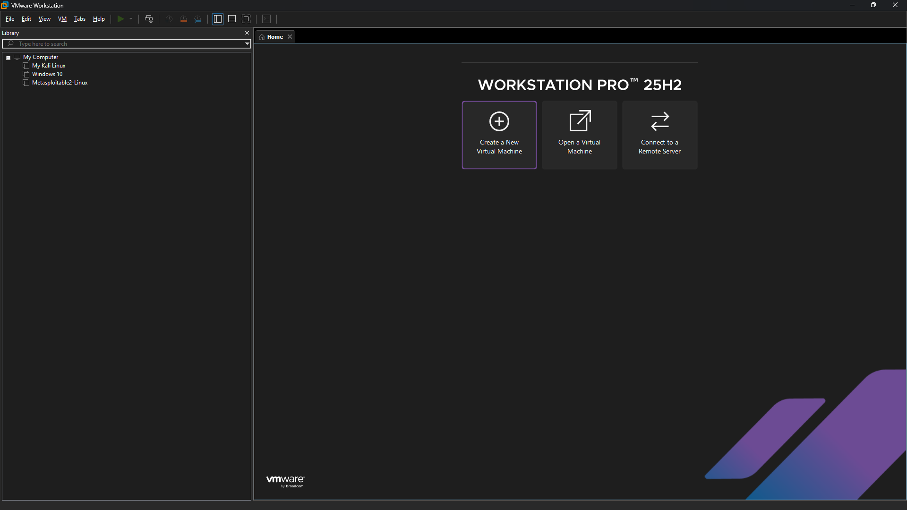

---

## 2. Kali Linux Virtual Machine (Initial Setup)

Kali Linux was configured as the primary security testing and attack simulation machine.

**Configuration:**

* Memory: 4 GB RAM
* CPU: 4 Cores
* Storage: 100 GB
* Network: NAT (Initial Setup)

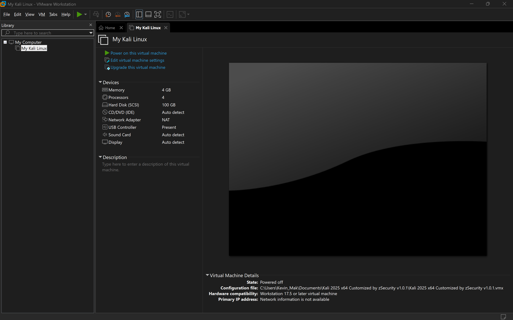

---

## 3. Windows 10 Virtual Machine (Initial Setup)

Windows 10 was configured as a target system for testing, monitoring, and security assessments.

**Configuration:**

* Memory: 4 GB RAM
* CPU: 2 Cores
* Storage: 40 GB
* Network: NAT (Initial Setup)

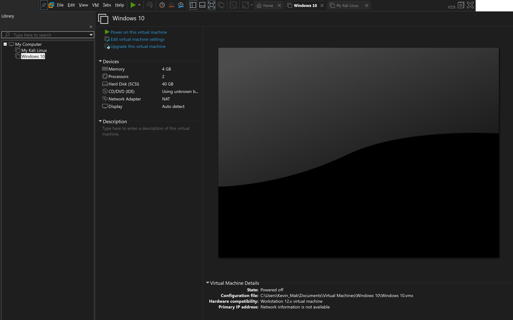

---

## 4. Metasploitable 2 Virtual Machine (Initial Setup)

Metasploitable 2 was deployed as a deliberately vulnerable system for penetration testing and security training purposes.

**Configuration:**

* Memory: 512 MB
* Storage: 8 GB
* Network: NAT (Initial Setup)

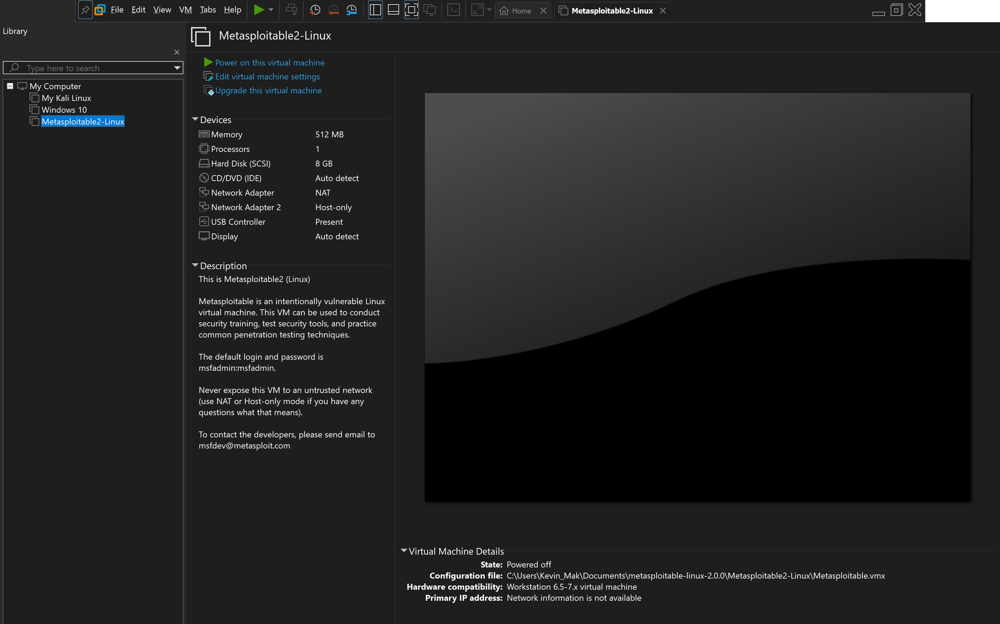

---

## Phase 1 Summary

All virtual machines were successfully deployed and configured using NAT networking to provide internet access for software installation, updates, and initial setup activities.

This phase established the foundation required for network segmentation, connectivity testing, and future security assessments.

---

# Phase 2: Network Segmentation & Lab Isolation

## Overview

In this phase, the virtual lab environment was reconfigured to establish a controlled and isolated internal network for cybersecurity testing.

The goal was to separate internal lab traffic from external internet access while enabling controlled communication between virtual machines.

This configuration simulates a realistic SOC and penetration testing environment where security assessments can be performed safely.

---

## Objectives

* Configure an isolated virtual network using VMware Workstation Pro
* Implement Host-Only networking for internal communication
* Validate IP addressing across all virtual machines
* Confirm connectivity between attacker and target systems
* Prepare the environment for scanning and security testing

---

## 1. Virtual Network Editor Configuration

VMware Virtual Network Editor was used to configure the isolated lab network.

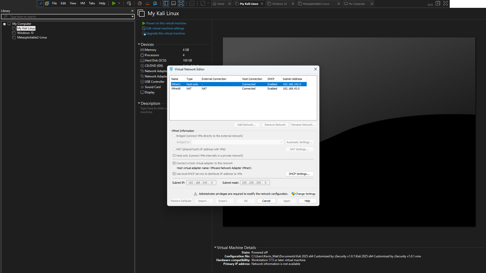

**Configuration:**

* Network Type: Host-Only (VMnet1)
* Subnet: 192.168.242.0/24
* DHCP: Enabled
* Host Adapter: Connected

---

## 2. Windows 10 Network Configuration

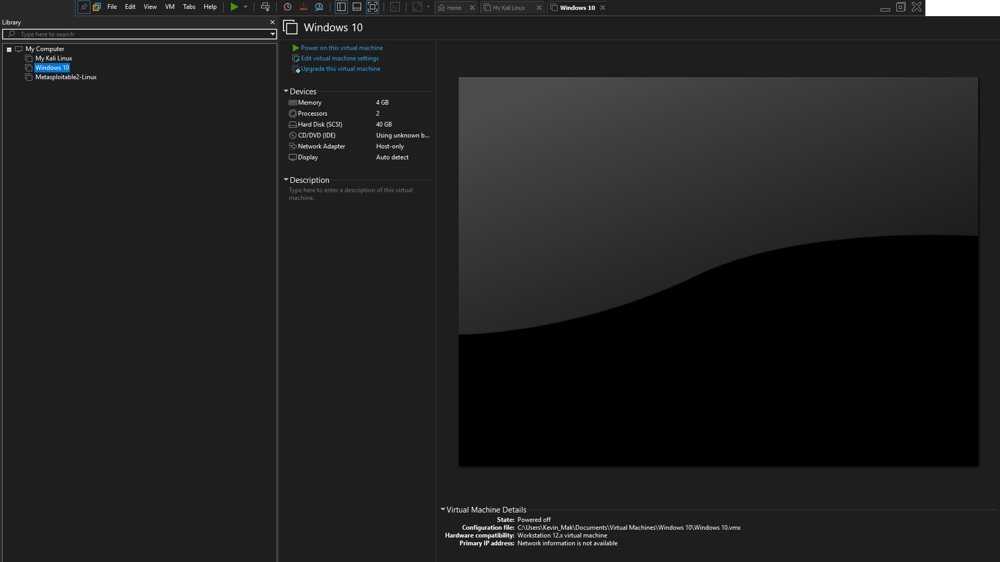

**Configuration:**

* Network Mode: Host-Only
* IP Address: 192.168.242.129
* Subnet Mask: 255.255.255.0

---

## 3. Metasploitable 2 Network Configuration

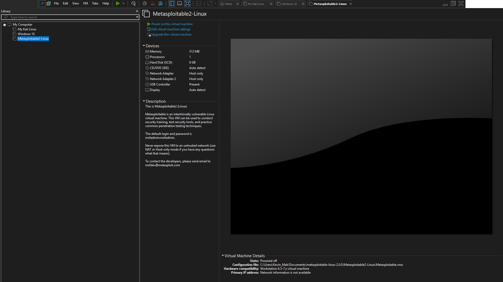

**Configuration:**

* Network Mode: Host-Only
* IP Address: 192.168.242.130
* Subnet Mask: 255.255.255.0

---

## 4. Kali Linux Network Configuration

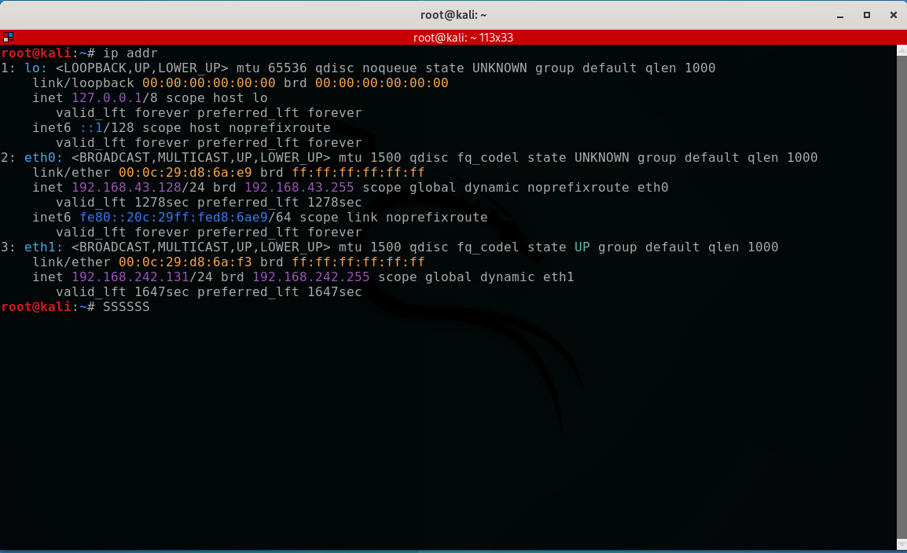

**Network Interfaces:**

* NAT Interface (Internet Access)
* Host-Only Interface (Internal Lab Network)

---

## 5. IP Address Verification

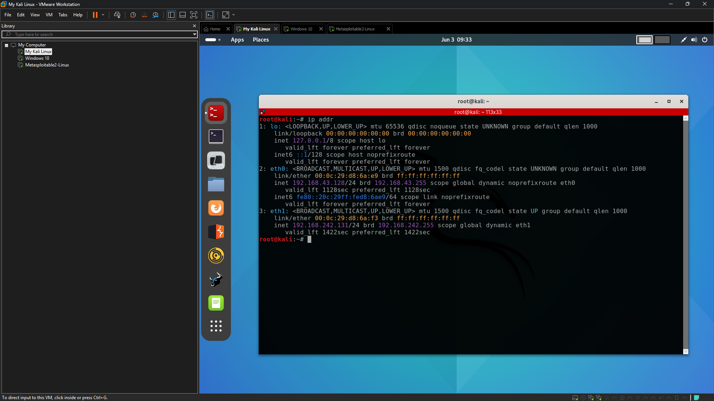  
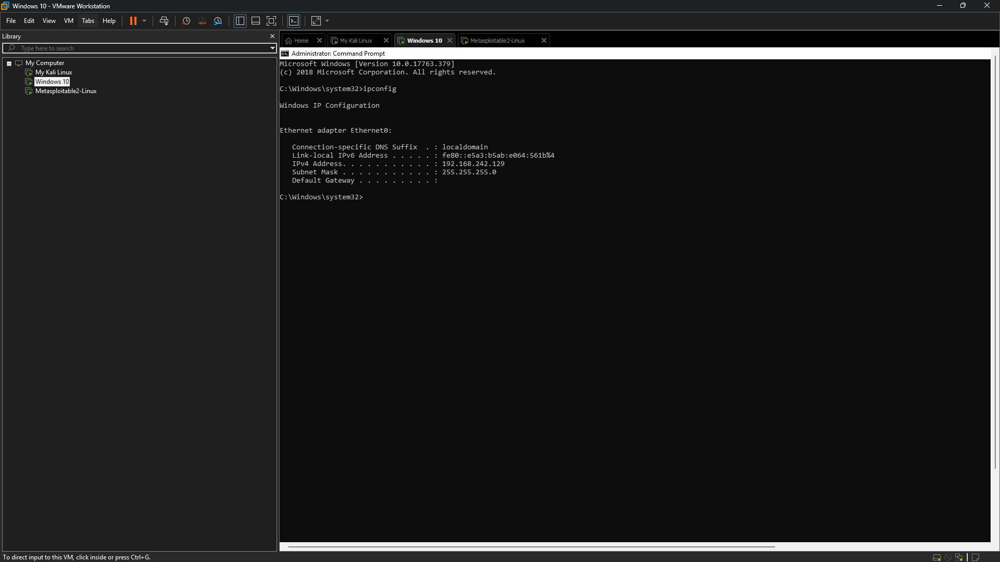  
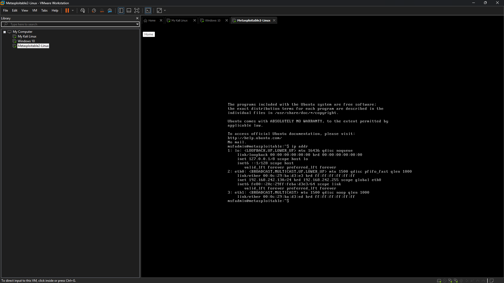

---

## 6. Connectivity Testing

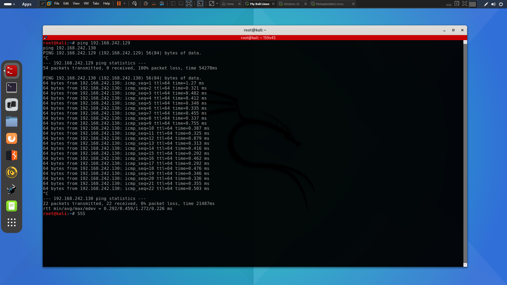

---

## Phase 2 Summary

Phase 2 successfully established a controlled and isolated virtual network environment using VMware Workstation Pro.

---

# Phase 3: Network Reconnaissance & Vulnerability Analysis

## Overview

In this phase, Kali Linux was used to perform network reconnaissance, port scanning, and service enumeration against the isolated lab environment.

---

## 1. Host Discovery (Network Scan)

A host discovery scan was performed using Nmap to identify active devices within the network.

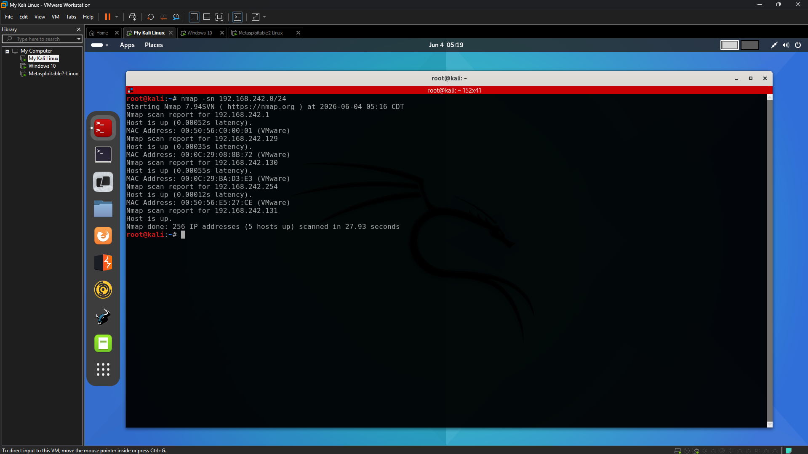

**Findings:**
- 192.168.242.1 (VMware interface)
- 192.168.242.129 (Windows 10)
- 192.168.242.130 (Metasploitable 2)
- 192.168.242.131 (Kali Linux)
- 192.168.242.254 (Gateway)

---

## 2. TCP SYN Port Scan (Metasploitable 2)

A SYN scan was performed to identify open ports.

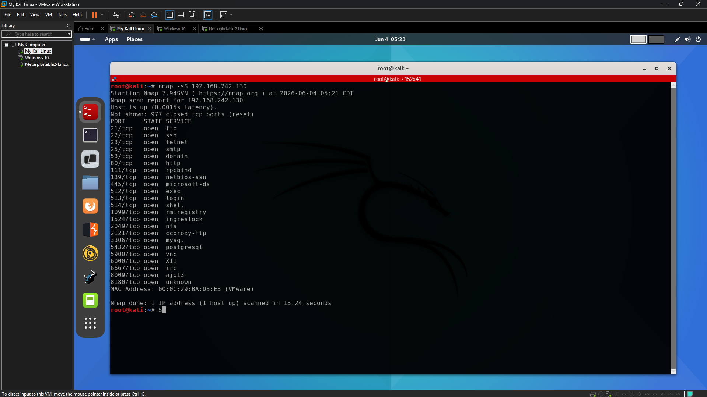

**Findings:**
- FTP (21)
- SSH (22)
- Telnet (23)
- HTTP (80)
- SMB (139/445)
- MySQL (3306)
- VNC (5900)
- And multiple additional services

---

## 3. Service Enumeration Scan

A version detection scan was performed to identify running services.

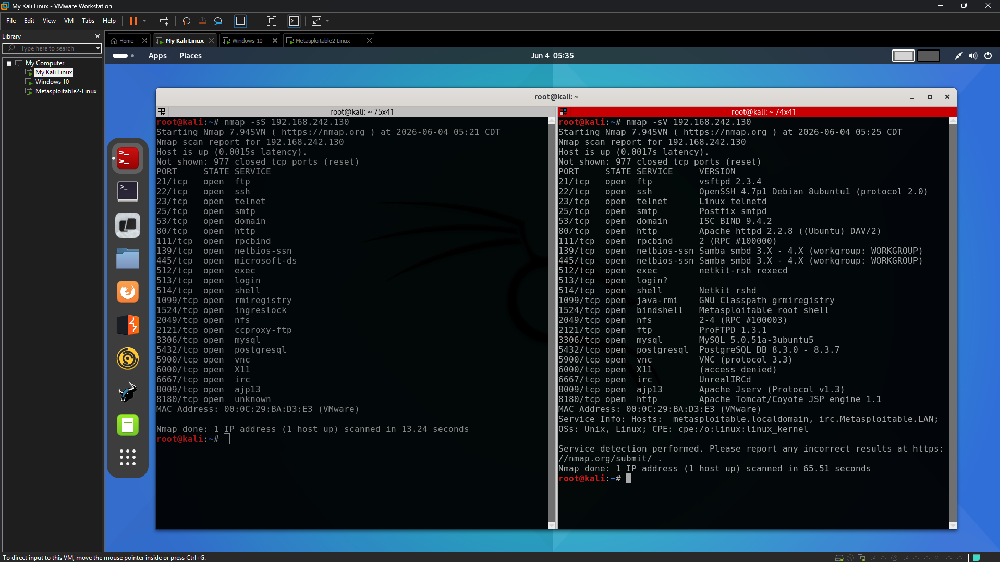

**Findings:**
- vsftpd 2.3.4
- OpenSSH 4.7p1
- Apache 2.2.8
- Samba 3.x
- MySQL 5.0.x
- PostgreSQL 8.3.x
- Telnet enabled
- VNC exposed

---

## 4. Vulnerability Analysis

Metasploitable 2 contains multiple security weaknesses:

- Outdated FTP (vsftpd 2.3.4)
- Telnet transmitting plaintext credentials
- Exposed SMB service
- Outdated Apache server
- Open database services
- Remote desktop (VNC) exposed
- Backdoor shell on port 1524

---

## Phase 3 Summary

This phase demonstrated practical penetration testing techniques including reconnaissance, port scanning, and service enumeration.

The results confirmed that the target system contains multiple vulnerabilities suitable for ethical hacking practice.

---

## Key Learning Outcomes

- Network reconnaissance using Nmap  
- Host discovery in isolated networks  
- TCP SYN scanning techniques  
- Service version detection  
- Vulnerability identification  
- Attack surface analysis  
